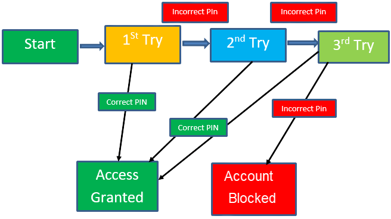

# Test Design

Boundary value analysis is based on testing at the boundaries between partitions. It includes maximum, minimum, inside or outside boundaries, typical values and error values.

## 1. Boundary Value Analysis (BVA)

Boundary value analysis is based on testing at the boundaries between partitions. It includes maximum, minimum, inside or outside boundaries, typical values and error values.
    
It is generally the case where a large number of errors occur at the boundaries of the defined input values rather than the center. This is also known as BVA, and it gives a selection of test cases which exercise bounding values. This software testing technique is based on the principle that, if a system works well for these particular values, it will work perfectly well for all values which come between the two boundary values.

### Guidelines for Boundary Value analysis

- If an input condition is restricted between values x and y, the test cases should be designed with values x and y as well as values which are above and below x and y.
- If an input condition is a large number of values, the test case should be developed in a way that needs to exercise the minimum and maximum numbers. Here, values above and below the minimum and maximum values are also tested.
- Apply guidelines 1 and 2 to output conditions. It will give you an output which reflects the minimum and the maximum values expected. It also tests the below or above values.

**Example:** Input condition is valid between `1 to 10`

Boundary values `0, 1, 2 and 9, 10, 11`

## 2. Equivalence Class Partitioning

The equivalent class partitioning implies splitting test data into classes, whereas all elements are similar in some ways. This technique makes sense only if the components are similar and can fit in a common group. The equivalent class partitioning is a good solution for cases when you deal with a large volume of incoming data or numerous identical input variations. Otherwise, it might makes sense to cover a product with tests more closely.
 
The concept behind this technique is that the test case of a representative value of each class is equal to a test of any other value of the same class. It allows you to identify valid as well as invalid equivalence classes.

**Example:**
    
Input conditions are valid between `1 to 10 and 20 to 30`
    
Hence there are five equivalence classes:

```
< 0 (invalid)
    
1 to 10 (valid)
    
11 to 19 (invalid)
    
20 to 30 (valid)
    
> 31 (invalid)
```

You select values from each class, i.e., `-2, 3, 15, 25, 45`

## 3. Decision Table Based Testing

A decision table is also known as the Cause-Effect table. This software testing technique is used for functions which respond to a combination of inputs or events. For example, a submit button should be enabled if the user has entered all required fields.

The first task is to identify functionalities where the output depends on a combination of inputs. If there are large input sets of combinations, divide it into smaller subsets which are helpful for managing a decision table.

For every function, you need to create a table and list down all types of combinations of inputs and its respective outputs. This helps to identify a condition that is overlooked by the tester.

### Following are steps to create a decision table:

- Enlist the inputs in rows
- Enter all the rules in the column
- Fill the table with the different combination of inputs
- In the last row, note down the output against the input combination

**Example:** A submit button in a contact form is enabled only when all the inputs are entered by the end user.
   
|         | Rule 1 | Rule 2 | Rule 3 | Rule 4 | Rule 5 | Rule 6 | Rule 7 | Rule 8 |
|---------|--------|--------|--------|--------|--------|--------|--------|--------|
| Input   |        |        |        |        |        |        |        |        |
| Name    | F      | T      | F      | T      | F      | T      | F      | T      |
| Email   | F      | F      | T      | T      | F      | F      | T      | T      |
| Message | F      | F      | F      | F      | T      | T      | T      | T      |
| Output  |        |        |        |        |        |        |        |        |
| Submit  | F      | F      | F      | F      | F      | F      | F      | T      |

## 4. State Transition

In the State Transition technique, changes in input conditions change the state of the Application under Test (AUT). This testing technique allows the tester to test the behavior of an AUT. The tester can perform this action by entering various input conditions in a sequence. In State transition technique, the testing team provides positive as well as negative input test values for evaluating the system behavior.

### Guideline for State Transition:

- State transition should be used when a testing team is testing the application for a limited set of input values.
- The technique should be used when the testing team wants to test a sequence of events which happen in the application under test.

**Example:**

In the following example, if the user enters a valid password in any of the first three attempts the user will be able to log in successfully. If the user enters the invalid password in the first or second try, the user will be prompted to re-enter the password. When the user enters the password incorrectly for the third time, the action has been taken, and the account will be locked.

### State transition diagram



## 5. Error Guessing

Error guessing is the most experimental practice of all, usually applied along with another test design technique. In error guessing, a QA specialist predicts where errors are likely to appear, relying on previous experience, knowledge of the system, and product requirements. Thus, a QA specialist is to identify spots where defects tend to accumulate and pay increased attention to those areas.

#### Guidelines for Error Guessing:
- The test should use the previous experience of testing similar applications
- Understanding of the system under test
- Knowledge of typical implementation errors
- Remember previously troubled areas
- Evaluate Historical data & Test results

#### Example:

QA engineers start with testing for common mistakes, such as:

- Entering blank spaces in text fields. 
- Pressing the Submit button without entering data.
- Entering invalid parameters (email address instead of a phone number, etc.). 
- Uploading files that exceed the maximum limit. … And so on. 

The more experience a QA specialist has, the more error guessing scenarios they can come up with quickly.